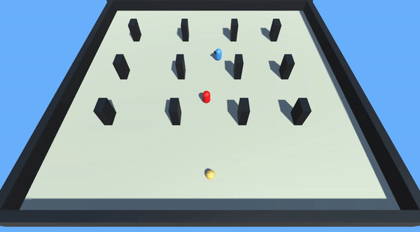

This is a unity project that I made to  better understand the State Design pattern. 
In the Sceene there is 3 main object  Guard :cop:  which protect the collectable from the Collector, Collector :imp: which tries to steal the collectable and the Collectable :yellow_circle:. 

# Object States
 ## :cop: Guard :cop:
- **Patrol State**: In this state, the Guard patrols the area randomly.

-  **Chase State**: While Patroling if the Guard sees the Collector Guard state changes to Chase state. In this state chases the Collector until it catches or Collector run away.

-  **Catch State**: While Chasing if the Guard touches the Collector  Guard state changes to Catch state. This state is a Guards win state

 ## :imp: Collector :imp:		
- **Patrol** State: In this state, the Collector patrols the area randomly.
- **Flee State**: While in patroling or collecting state if the Collector can see the Guard Collector state changes to Flee state. In this state, the Collector runs away from the Guard until it is far enough. 
- **Collect State**: While Patroling if the Collector sees the Collectable, the Collector state changes to Collect state. In this state collector approaches to the collectible and collects when it is close enough. This is the Collector's win state.
  
## Preview

  

<h3 align="center">
 
 [For More Gameplay](https://youtu.be/TqAZ5baDbpg)
 
</h3>

## Assets
Particle Effects = [Simple FX - Cartoon Particles](https://assetstore.unity.com/packages/vfx/particles/simple-fx-cartoon-particles-67834)

